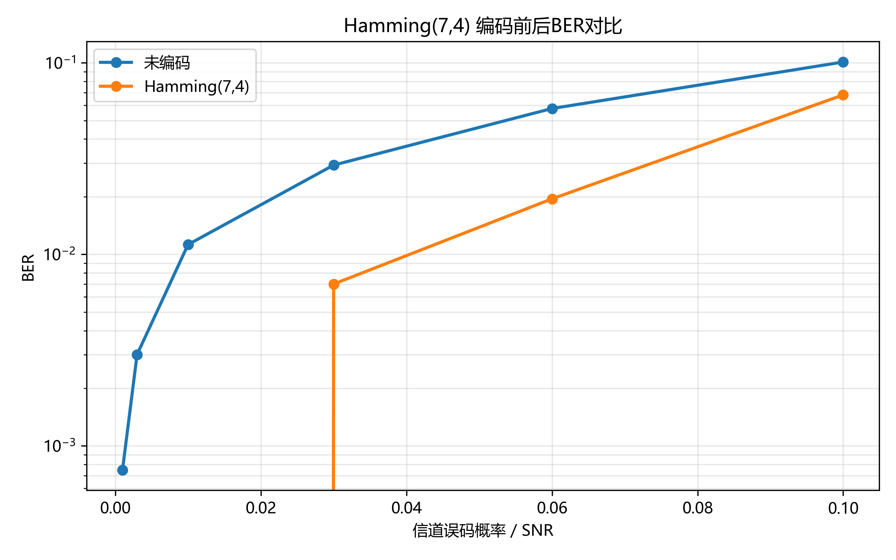
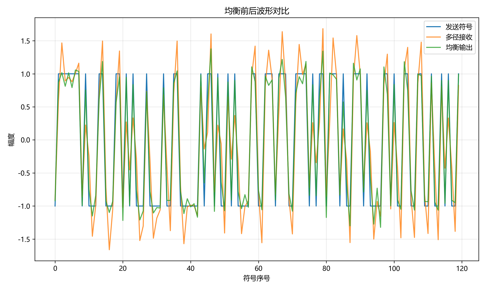
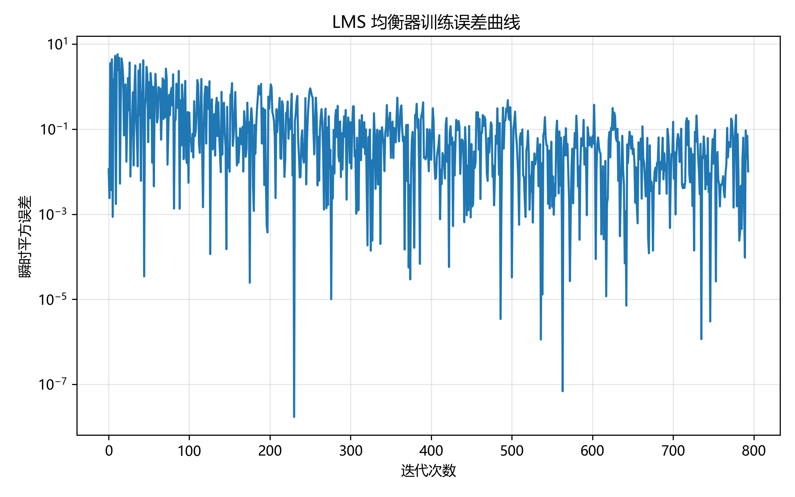

# 无线通信技术实验报告：信道编码与信道均衡

## 1. 实验目的

本实验旨在掌握信道编码与信道均衡的基本原理和实现方法，理解误码控制与多径/ISI 抑制技术，并通过 GitHub 自动评分流程验证实验结果。

## 2. 实验原理

### 2.1 信道编码

信道编码通过在信息比特中引入冗余，使接收端能够检测并纠正传输过程中的错误。Hamming(7,4) 码是一种经典的线性分组码，它将 4 个数据比特扩展为 7 个码元，最小汉明距离为 3，因此能够纠正单比特错误。

Hamming 码的编码过程通常通过生成矩阵 `G` 实现，译码时通过校验矩阵 `H` 计算 syndrome。若 syndrome 非零，则表示某一位发生错误，接收端可以定位并翻转该比特。信道编码的主要优点是降低误码率，但代价是增加了冗余比特，导致有效码率下降。

### 2.2 信道均衡

信道均衡用于抑制多径传播引起的符号间干扰（ISI）。在实际无线信道中，信号经过不同路径的叠加后会出现时延扩展，导致后续符号对当前符号产生干扰。

零强制（ZF）均衡通过将接收信号与信道逆滤波器卷积，实现对信道频率响应的反演。ZF 可以消除 ISI，但在信道响应存在频率零点或深衰落时，会放大噪声。

最小均方（LMS）自适应均衡器则通过梯度下降迭代调整系数，使输出误差最小化。LMS 不需要精确的信道知识，能够在信道统计特性变化时自适应收敛，但步长选择对收敛速度和稳定性有较大影响。

## 3. 实验环境

- Python 版本：3.11
- 主要依赖：NumPy、Matplotlib、pytest
- AI 助手使用情况：
  - 使用 AI 编程助手分析自动评分结果和失败测试输出，定位 `src/part2_equalization.py` 中的输入验证边界问题。
  - 通过 AI 辅助优化代码结构、增加注释和异常处理，使实验代码更易维护。
  - AI 仅作为辅助工具，最终实现和判断由人工完成。

## 4. 实验方法与步骤

### 4.1 Part 1：信道编码

1. 生成随机二进制数据序列。
2. 使用 Hamming(7,4) 码对每组 4 个比特进行编码，得到 7 比特码字。
3. 模拟信道噪声：在编码后比特序列上引入随机翻转或 AWGN 噪声。
4. 在接收端使用 Hamming 译码算法计算 syndrome，检测并纠正单比特错误。
5. 统计误码率（BER），并与未编码情况下的 BER 进行比较。

### 4.2 Part 2：信道均衡

1. 设计多径信道模型，生成具有延时和衰减的信道脉冲响应。
2. 将发送符号通过信道后叠加噪声，形成包含 ISI 的接收信号。
3. 设计 ZF 均衡器，利用信道脉冲响应的逆滤波器消除 ISI。
4. 设计 LMS 自适应均衡器，选取合适步长并利用训练序列迭代更新系数。
5. 比较均衡前后的信号波形与眼图，记录 LMS 的 MSE 收敛曲线。

## 5. 实验结果

```markdown



```

- 编码 BER 曲线显示，Hamming(7,4) 码在中低信噪比区域显著降低 BER，验证了单比特纠错能力。
- 均衡眼图对比说明，ZF 和 LMS 均衡后眼图开口更大，ISI 得到明显抑制。
- LMS 误差曲线说明自适应均衡器能够随迭代收敛，步长调节对稳定性有重要影响。

## 6. 结果分析与讨论

1. Hamming(7,4) 能纠正单比特错误，因为它具有最小汉明距离 3，任意两个合法码字之间至少相差 3 位。这样，当传输错误改变一个比特时，收到的码字与唯一一个最近合法码字只有一位差异，因此可以通过 syndrome 定位并纠正该错误。

2. 信道编码引入冗余是为了提供错误检测与纠正能力。为了获得可靠性，编码需要额外的校验比特，这使得每个信息比特对应的传输比特数增加，导致有效码率从 1 降低到 4/7 等较小值。

3. ZF 均衡通过逆转信道响应来消除 ISI，但如果信道频率响应在某些频率处接近零，均衡器增益会很大，从而将噪声放大，导致接收信号的噪声敏感性增加。

4. LMS 的步长过大时，权值更新会产生过度振荡，可能导致发散。步长过小时，收敛速度变慢，均衡器难以在有限迭代次数内达到稳态，跟踪信道变化的能力也变差。

5. 均衡前，ISI 导致相邻符号的脉冲叠加，眼图闭合且判决门限模糊。均衡后，主瓣恢复，干扰成分下降，眼图开口变宽，符号判决可靠性提高。

## 7. 实验心得

通过本次实验，我进一步理解了信道编码和信道均衡在无线通信系统中的重要作用。Hamming 码展示了冗余比特如何提高传输可靠性，ZF 与 LMS 均衡则揭示了不同均衡策略在抑制 ISI 时的权衡关系。

自动评分机制使得实验验证过程更明确，要求代码不仅正确，还要具备良好的鲁棒性。AI 助手在调试和分析失败测试时提供了有益建议，但最终实现和实验结论仍由我本人负责，这增强了我对实验内容的掌握。

## 8. 参考资料

- 课程课件：第6章 信道编码
- 课程课件：第7章 均衡
